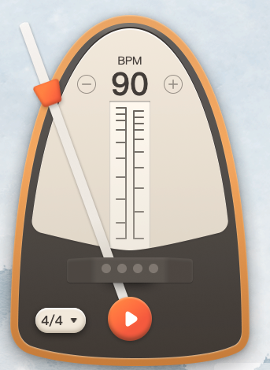

# 节拍器

;

# 安装

```shell
$ npm i @likg/metronome
$ pnpm i @likg/metronome
$ yarn add @likg/metronome
```

# 使用

```tsx
import MetronomeCls from '@likg/metronome';
const metronomeCls = new MetronomeCls(options: MetronomeOptions);
```

# API

```tsx
/**
 * options
 * @param {*} options
 * @param {*} options.onBeatChange
 * @returns
 */
start(options: StartOptions): Promise<void>;
/**
 * 播放
 * @returns
 */
stop(): void;
/**
 * 设置BPM
 * @param {*} bpm
 */
setBPM(bpm: number): void;
/**
 * 设置拍号
 * @param {*} timeSignature
 */
setTimeSignature(timeSignature: string): void;
/**
 * 释放资源
 */
destroy(): Promise<void>;
```

# MetronomeOptions

```ts
export type MetronomeOptions = {
	/** BPM */
	bpm: number;
	/** 拍号 */
	timeSignature: TimeSignature;
	/** 主音资源链接 */
	accentSoundUrl: string;
	/** 次音资源链接 */
	normalSoundUrl: string;
};
```

# StartOptions
```ts
export type StartOptions = {
	onPlay?: () => void;
	onBeatChange?: (beatIndex: number) => void;
};
```